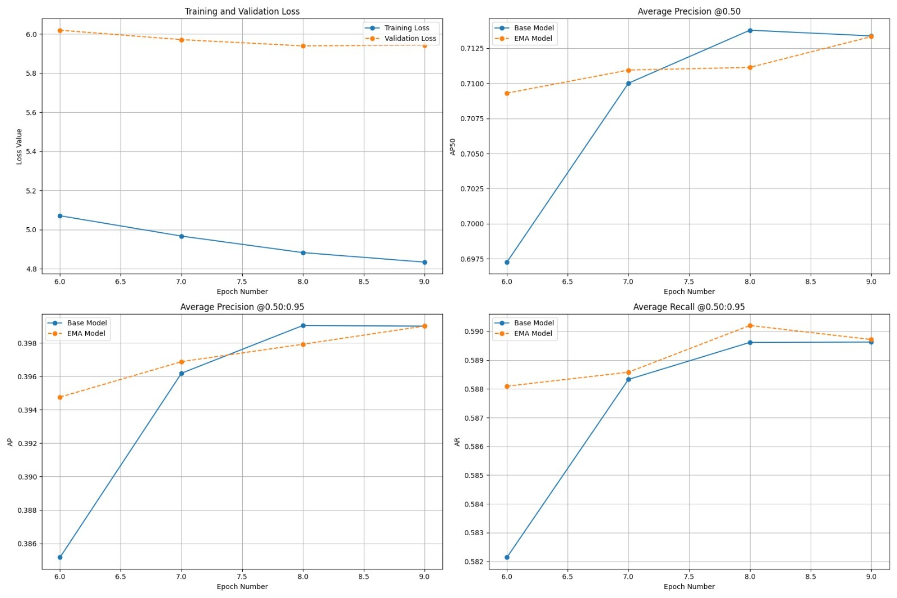

# PPE Detection Model Training - RF-DETR

Training pipeline for PPE detection using RF-DETR transformer architecture on bias-reduced super-dataset.

## Model Details

- **Architecture**: RF-DETR (Real-time DEtection TRansformer)
- **Dataset Format**: COCO
- **Classes**: 10 PPE categories
- **Input Size**: 640x640

## Dataset

- **Training Dataset**: [COCO Format](https://drive.google.com/file/d/1dQkG__0FmF2zBZ44n3hhPfBGTI_g4PVk/view?usp=sharing)
- **Bias Reduction**: Smart cropping (torso, upper body, lower body regions)
- **Custom Data**: 210 manually annotated frames from front camera footage

## Results

### Overall Performance
- **Validation**: mAP@50: 71.34% | mAP@50-95: 39.90% | Precision: 73.88% | Recall: 64.00%
- **Test**: mAP@50: 57.97% | mAP@50-95: 33.10% | Precision: 53.34% | Recall: 73.00%

### Class Performance (Validation Set)

| Class | mAP@50-95 | mAP@50 | Precision | Recall |
|-------|-----------|--------|-----------|--------|
| vest | 73.25% | 96.86% | 99.05% | 64.00% |
| helmet | 59.24% | 96.24% | 98.95% | 64.00% |
| no-helmet | 45.06% | 76.50% | 95.30% | 64.00% |
| boots | 43.72% | 80.95% | 86.77% | 64.00% |
| no-vest | 40.54% | 68.80% | 66.59% | 64.00% |
| gloves | 36.64% | 77.05% | 81.36% | 64.00% |
| no-gloves | 29.97% | 64.01% | 70.26% | 64.00% |
| goggles | 28.53% | 52.11% | 50.71% | 64.00% |
| no-boots | 25.71% | 56.81% | 52.09% | 64.00% |
| no-goggles | 16.36% | 44.04% | 37.68% | 64.00% |

## Training Plots


*Training loss, validation loss, mAP@50, and mAP@50-95 curves*

## Model Checkpoint

**[Trained RF-DETR Model](https://drive.google.com/file/d/1Jd9TJaclKBvQM9S5303SPGA5fcEMca0d/view?usp=sharing)**


## Key Observations

- **Strong Performance**: Vest and helmet detection (>96% mAP@50)
- **Domain Gap**: 13% drop in mAP@50 from validation to test
- **Challenging Classes**: Goggles and negative classes need improvement
- **Bias Reduction**: Consistent recall across classes indicates reduced positional bias

## Requirements

```bash
pip install torch torchvision
pip install pycocotools
pip install opencv-python
pip install pyyaml
pip install rfdetr supervision
```

**Hardware**: 8GB+ GPU, 16GB RAM recommended
